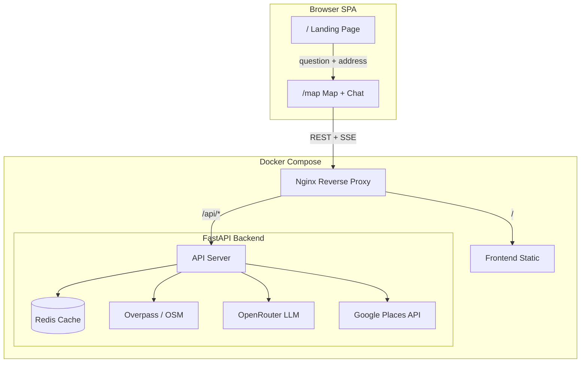

# GenGeo — AI-Powered Location Analyst

GenGeo lets anyone ask natural-language questions about any location on Earth and get AI-powered answers grounded in real geospatial data from OpenStreetMap.

> *"How walkable is this area?" · "Is it good for families?" · "What transit options are nearby?"*

## Architecture



| Layer | Stack |
|-------|-------|
| **Frontend** | React 19, TypeScript, Vite, TanStack Router, MapLibre GL, Zustand, Tailwind CSS v4 |
| **Backend** | Python 3.12, FastAPI, Pydantic, httpx, uv |
| **Cache** | Redis 7 (ephemeral context + region cache) |
| **Data** | OpenStreetMap via Overpass API |
| **AI** | OpenRouter (Gemini 2.5 Flash) with structured JSON output |
| **Geocoding** | Google Places API (server-side proxy) |
| **Infra** | Docker Compose, Nginx, Let's Encrypt TLS |

## Quick Start

### Prerequisites

- Docker & Docker Compose
- A Google Maps API key with **Places API** enabled
- An OpenRouter API key

### 1. Clone & configure

```bash
git clone https://github.com/<your-org>/genai-2026.git
cd genai-2026
cp .env.example .env
# Fill in OPENROUTER_API_KEY and GOOGLE_MAPS_API_KEY
```

### 2. Run (development)

```bash
docker compose up
```

This starts all services:
- **Frontend** → http://localhost (via Nginx)
- **Backend API** → http://localhost:8000 (direct)
- **Redis** → localhost:6380

### 3. Run (production)

```bash
docker compose -f docker-compose.yml -f docker-compose.prod.yml up -d
```

### Local frontend dev (hot-reload)

```bash
cd frontend
cp .env.template .env
npm install
npm run dev          # → http://localhost:5173
```

The Vite dev server proxies `/api/*` to the backend automatically.

## Environment Variables

| Variable | Where | Required | Description |
|----------|-------|----------|-------------|
| `OPENROUTER_API_KEY` | `.env` (root) | Yes | OpenRouter API key for LLM calls |
| `GOOGLE_MAPS_API_KEY` | `.env` (root) | Yes | Google Places API key (server-side only) |
| `LLM_MODEL_ID` | `.env` (root) | No | Model ID (default: `google/gemini-2.5-flash-preview`) |
| `REDIS_URL` | `.env` (root) | No | Redis connection string (default: `redis://redis:6379/0`) |
| `VITE_MAP_STYLE_URL` | `frontend/.env` | No | MapLibre tile style URL |
| `VITE_USE_MOCKS` | `frontend/.env` | No | Set to `false` to call real backend |

## API Endpoints

| Method | Path | Description |
|--------|------|-------------|
| `GET` | `/api/health` | Health check (Redis + data sources) |
| `POST` | `/api/contexts` | Create a region context from lat/lon/radius |
| `POST` | `/api/chat/stream` | Stream a chat response (SSE) |
| `GET` | `/api/geocode/autocomplete?input=...` | Address autocomplete (Google Places proxy) |
| `GET` | `/api/geocode/place?place_id=...` | Place details with lat/lon (Google Places proxy) |

## How It Works

1. **Landing page** — User types a question and optionally an address (autocompleted via server-side Google Places proxy).
2. **Map page** — If an address was provided, the map flies to that location with a 500m default radius. Otherwise, the user drops a pin manually and clicks to set a radius.
3. **Context creation** — The backend queries Overpass API for OSM data within the radius, builds a region profile (amenity counts, transit, land use), and caches it in Redis.
4. **Chat** — The user's question is sent alongside the region profile to the LLM. Responses stream back via SSE with structured metadata (evidence, confidence, limitations).
5. **Follow-up** — Multi-turn chat maintains context for the same region.

## Project Structure

```
genai-2026/
├── backend/
│   ├── app/
│   │   ├── main.py              # FastAPI app + routes
│   │   ├── config.py            # Pydantic settings
│   │   ├── schemas.py           # Request/response models
│   │   ├── geocode.py           # Google Places proxy
│   │   ├── llm_client.py        # OpenRouter streaming
│   │   ├── chat_stream.py       # SSE event generator
│   │   ├── prompt_builder.py    # System prompt construction
│   │   ├── profile_aggregator.py
│   │   ├── cache/               # Redis context store
│   │   └── datasources/         # Pluggable data providers
│   ├── tests/
│   ├── Dockerfile
│   └── pyproject.toml
├── frontend/
│   ├── src/
│   │   ├── api/client.ts        # API client + mock layer
│   │   ├── pages/MapPage.tsx    # Map + chat orchestration
│   │   ├── map/MapView.tsx      # MapLibre GL map
│   │   ├── chat/ChatPanel.tsx   # Chat interface
│   │   ├── components/landing/  # Landing page
│   │   ├── ds/                  # Design system (tokens, icons)
│   │   ├── store.ts             # Zustand state management
│   │   └── routes/              # TanStack file-based routes
│   ├── Dockerfile
│   └── package.json
├── nginx/                       # Reverse proxy configs
├── redis/                       # Redis config
├── docker-compose.yml           # Base services
├── docker-compose.override.yml  # Dev overrides
├── docker-compose.prod.yml      # Production overrides
└── .env.example                 # Environment template
```

## License

Built for GenAI Genesis 2026.
